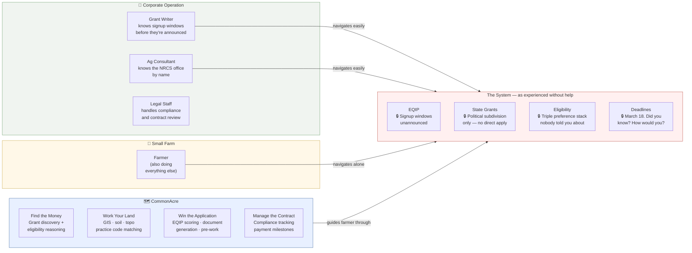

# Whey Cool Ranch

**Grade A Raw Goat Dairy · Celeste, TX · Northeast Texas Blackland Prairie**

Woman-owned. Veteran household. Beginning farmer, year one. Building tools the farm actually needs — and publishing them at prices small farms can actually pay.

---

## The Farm

Nubian dairy goats, permitted Grade A Raw-for-Retail. Miniature Zebu cattle on rotational pasture. Egyptian Fayoumi chickens handling pest suppression. Market garden with a 61,500-gallon/year rainwater reclamation system in progress.

The dairy sets the rhythm. Everything else fits around it.

---

## The Software

Tools built here start as operational problems on this farm. When they work, they go public — priced for farms that look like this one, not for investors.

| Project | What it does | Status |
|---------|-------------|--------|
| [**HerdMate**](https://github.com/Whey-Cool-Ranch/herdmate) | Goat herd management built for small farms — the institutional knowledge that commercial operations pay consultants for, in your pocket, free for up to 10 goats | Active development |
| [**CommonAcre**](https://github.com/Whey-Cool-Ranch/commonacre) | Agricultural program navigator — grant discovery, eligibility, land analysis | Spec complete, build starting |
| [**Claude Workshop**](https://github.com/Whey-Cool-Ranch/claude-workshop) | AI plugin infrastructure for the portfolio | Active |

No VC. No ads. No data selling. Pricing set by what a small farm would actually pay.

---

## Why This Exists

Small farms lose — not because they're bad at farming, but because the system isn't built for them. Corporate operations have grant writers, ag consultants, legal staff, and full-time people whose only job is navigating the programs that are supposed to help family farms too.

These tools exist to close that gap. Not to save small farms — they don't need saving. Just to even the odds a little.



---

## The Org

```
whey-cool-ranch   Farm operations, grant tracking, portfolio docs
herdmate          Goat herd management SaaS
commonacre        Agricultural program navigator (coming)
claude-workshop   Plugin design infrastructure
brand             Voice, visual, social, content
```

---

📍 Celeste, TX · [facebook.com/wheycoolranch](https://www.facebook.com/wheycoolranch/) · First tool: HerdMate. First grant project: gutters on a barn.
