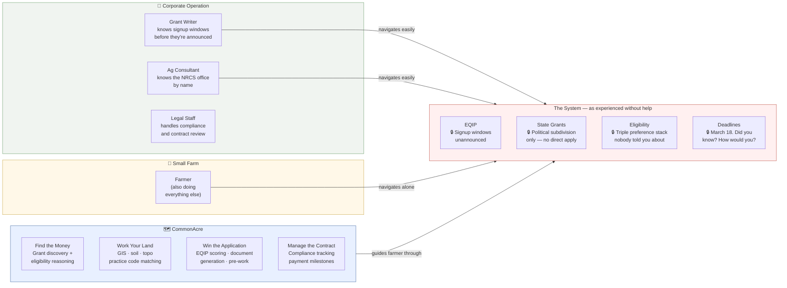

# Whey Cool Ranch

**Grade A Raw Goat Dairy · Celeste, TX · Northeast Texas Blackland Prairie**

---

## The Farm

**Grade A Raw Goat Dairy** — the dream job I wanted to retire to, so I started early. The focus is returning "show quality" to what it was meant to be: a showcase of beautiful, healthy, long-lived Nubian dairy goats capable of pasture-based production — cost-efficient, nutrient-dense, high-quality raw milk, retail-permitted and direct to consumer.

**Miniature Zebu cattle** earn their place on multiple fronts: rotational grazing alongside the goats for parasite cycle management, soil-up regenerative silvopasture restoration on native Blackland Prairie, and a level of ease that full-size cattle simply don't offer. They fit through the goat doors. They're gentle on the land, the fences, and the equipment. The bull is peaceful enough to walk fence lines with. Unlike sheep, they share nutrient requirements and infrastructure with the goats. Unlike beef cattle, they don't require you to watch your back. On the horizon: A2A2 milk production and a livestock project for younger 4H and FFA kids — paying forward the education we received when we were those kids. Even if none of that materializes, they're so low-maintenance and genuinely joyful to have around that they've earned a permanent place here.

**Egyptian Fayoumi chickens** — rare-breed, heat-tolerant, disease-resistant, and highly predator-aware — do their chicken thing without hand-holding. Clean coop, feed, water. In return: first-line defense against grasshoppers, crickets, fire ants, mice, and snakes. No pesticides. Eggs as a bonus. Active, aware birds that are a pleasure to watch and earn their keep every single day.

**Market garden** Starting with the household. The horizon is the neighborhood — fresh, wholesome, real foods available to people who don't have the time, knowledge, or space to grow their own.The vision: fed by dairy compost, irrigated by a 61,500-gallon/year rainwater reclamation system.

The dairy sets the rhythm. Everything else fits around it.

---

## The Software

Every tool here started as a problem on this farm — something Megan needed, couldn't find, and built. When it works here, it goes public. Pricing is set by what a small farm can actually afford, not what the work is worth. That's a deliberate choice: she wants to earn a living, not get rich, and she's not willing to price out the peers she's building for.

No VC. No ads. No data selling.

| Project | What it does | Status |
|---------|-------------|--------|
| [**HerdMate**](https://github.com/Whey-Cool-Ranch/herdmate) | Goat herd management built for small farms — the institutional knowledge that commercial operations pay consultants for, in your pocket, free for up to 10 goats | Active development |
| [**CommonAcre**](https://github.com/Whey-Cool-Ranch/commonacre) | Agricultural program navigator — grant discovery, eligibility, land analysis | Spec complete, build starting |

---

## Why This Exists

Small farms lose — not because they're bad at farming, but because the system isn't built for them. Corporate operations have grant writers, ag consultants, legal staff, and full-time people whose only job is navigating the programs that are supposed to help family farms too.

These tools exist to close that gap. Not to save small farms — they don't need saving. Just to level the playing field a little.



---

## The Org

```
whey-cool-ranch   Farm operations, grant tracking, portfolio docs
herdmate          Goat herd management SaaS
commonacre        Agricultural program navigator (coming)
claude-workshop   Plugin design infrastructure
brand             Voice, visual, social, content
```

---

📍 Celeste, TX · [facebook.com/wheycoolranch](https://www.facebook.com/wheycoolranch/) · First tool: HerdMate. First grant project: gutters on a barn.
