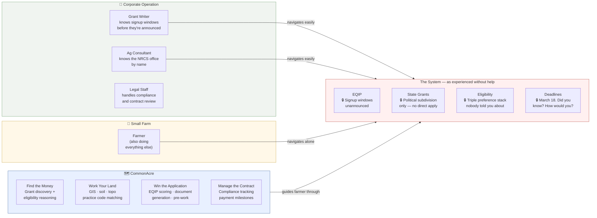

# Whey Cool Ranch

**Grade A Raw Goat Dairy · Celeste, TX · Northeast Texas Blackland Prairie**

---

## The People

**Megan** spent decades in software development, journalism, community management, and government communications learning how complex systems work — and how badly they fail the people they're supposed to serve. She grew up in rural Indiana, raised dairy goats and horses in 4H, watched farming communities hollow out through the 80s and 90s, and eventually built a career that crossed between technical systems and institutional ones. She's the one who connects the dots. Sees the meta. Understands that the farm biome, the USDA program landscape, and the software architecture are all versions of the same problem: complex systems that reward people who can read them and punish people who can't.

**Jeremiah** is a Marine Corps veteran, medically discharged, who built a career in aerospace the hard way — starting as an aviation hydraulics and structures specialist with hands physically in the work, and earning his way up through tenacity, an exceptional eye for detail, and a rare instinct for both solving problems and developing the people around him. He is currently a Quality Director, which means he is the person who signs his name to the work and carries the professional and legal weight of that signature. 

His career has put him in the room for some of the most significant engineering programs of the last two decades — including the Virgin Galactic SpaceShip2 program, the Northrop Grumman B-21 Raider, and the spinup of General Dynamics' Mesquite, TX munitions facility opened in 2024. The teams he has built and led stay connected to him long after they move on — that kind of loyalty is earned, not managed. He thinks in physical systems, real-world constraints, and first-principles problem solving: the kind where the weld either holds or it doesn't, and where the answer to a problem is a thing you build, not a workaround you tolerate. 

While still carrying that full career, he is already the physical architect of this farm — the rainwater reclamation system, the barn infrastructure, the continuous stream of clever, cost-effective solutions to everyday operational problems that would otherwise require expensive contractors or compromised workarounds. When his corporate exit is complete, that engineering instinct comes to the farm full time.

Together: one person who sees how systems connect, one person who builds what those systems require in the physical world. The software, the workflows, the planning, the deep understanding of natural systems, and the passion for making things work with nature rather than against it — that comes from Megan. The infrastructure, the physical problem-solving, the hands-on engineering that turns a plan into something that stands up and works — that comes from Jeremiah. 

What they're building is already a working farm, founded on a version of sustainability that means something to them on a personal level: working with and respecting nature in all her glory, respecting and loving the sentient species they share their lives with, proving that farming well is founded in a love of the land, the livestock, and the world at large. This farm is the core that gives them the ability to contribute to society by supporting lives and communities and leaving the world a little better than they found it in ways they can actually see and touch.

---

## The Farm

**Grade A Raw Goat Dairy** — the dream job we planned to retire to, so we started early. The focus is returning "show quality" to what it was meant to be: a showcase of beautiful, healthy, long-lived Nubian dairy goats capable of pasture-based production — cost-efficient, nutrient-dense, high-quality raw milk, retail-permitted and direct to consumer.

**Miniature Zebu cattle** earn their place on multiple fronts: rotational grazing alongside the goats for parasite cycle management, soil-up regenerative silvopasture restoration on native Blackland Prairie, and a level of ease that full-size cattle simply don't offer. They fit through the goat doors. They're gentle on the land, the fences, and the equipment. The bull is peaceful enough to walk fence lines with. Unlike sheep, they share nutrient requirements and infrastructure with the goats. Unlike beef cattle, they don't require you to watch your back. On the horizon: A2A2 milk production and a livestock project for younger 4H and FFA kids — paying forward the education we received when we were those kids. Even if none of that materializes, they're so low-maintenance and genuinely joyful to have around that they've earned a permanent place here.

**Egyptian Fayoumi chickens** — rare-breed, heat-tolerant, disease-resistant, and highly predator-aware — do their chicken thing without hand-holding. Clean coop, feed, water. In return: first-line defense against grasshoppers, crickets, fire ants, mice, and snakes. No pesticides. Eggs as a bonus. Active, aware birds that are a pleasure to watch and earn their keep every single day.

**Market garden** fed by dairy compost, irrigated by a 61,500-gallon/year rainwater reclamation system in progress. Starting with the household. The horizon is the neighborhood — fresh vegetables available to people who don't have the time, knowledge, or space to grow their own.

The dairy sets the rhythm. Everything else fits around it.

---

## The Software

Every tool here started as a problem on this farm — something Megan needed, couldn't find, and built. When it works here, it goes public. Pricing is set by what a small farm can actually afford, not what the work is worth. That's a deliberate choice: she wants to earn a living, not get rich, and she's not willing to price out the peers she's building for.

No VC. No ads. No data selling.

| Project | What it does | Status |
|---------|-------------|--------|
| [**HerdMate**](https://github.com/Whey-Cool-Ranch/herdmate) | Goat herd management built for small farms — the institutional knowledge that commercial operations pay consultants for, in your pocket, free for up to 10 goats | Active development |
| [**CommonAcre**](https://github.com/Whey-Cool-Ranch/commonacre) | Agricultural program navigator — grant discovery, eligibility, land analysis | Spec complete, build starting |

---

## Why This Exists

Small farms lose — not because they're bad at farming, but because the system isn't built for them. Corporate operations have grant writers, ag consultants, legal staff, and full-time people whose only job is navigating the programs that are supposed to help family farms too.

These tools exist to close that gap. Not to save small farms — they don't need saving. Just to even the odds a little.



---

## The Org

```
whey-cool-ranch   Farm operations, grant tracking, portfolio docs
herdmate          Goat herd management SaaS
commonacre        Agricultural program navigator (coming)
claude-workshop   Plugin design infrastructure
brand             Voice, visual, social, content
```

---

📍 Celeste, TX · [facebook.com/wheycoolranch](https://www.facebook.com/wheycoolranch/) · First tool: HerdMate. First grant project: gutters on a barn.
